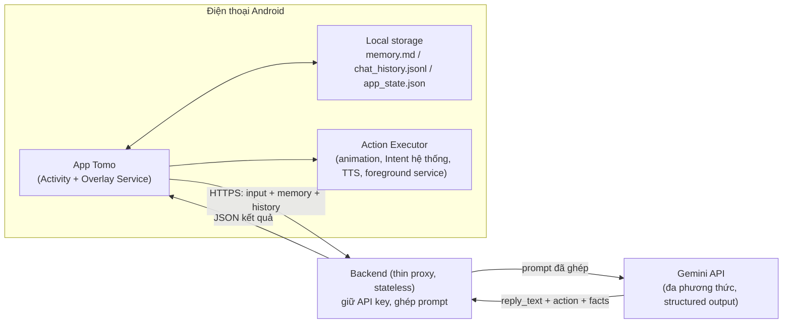
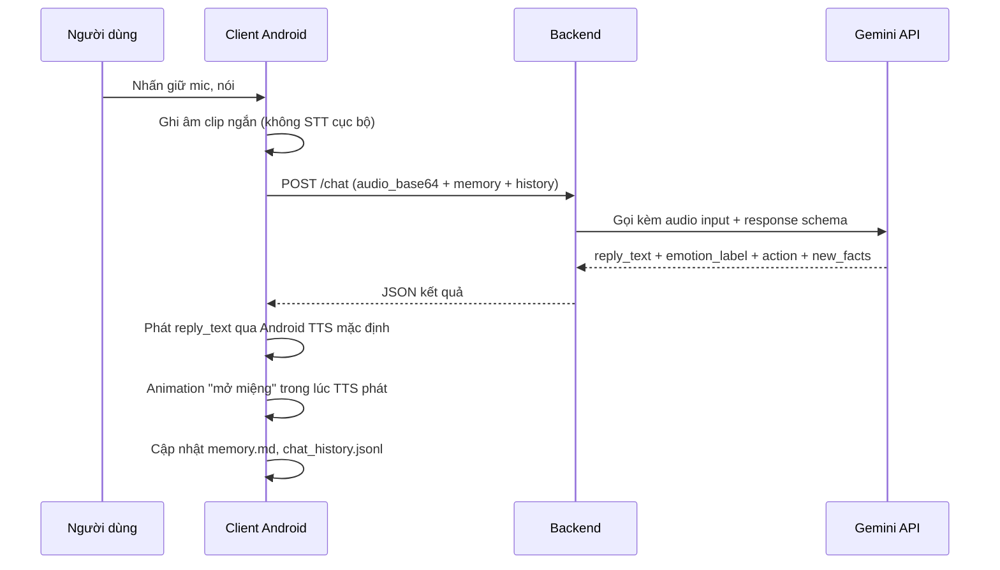

# TOMO — Kiến trúc & Luồng hoạt động tổng quan (MVP)

> Tài liệu này mô tả kiến trúc hệ thống và luồng hoạt động ở mức tổng quan cho **bản MVP** của Tomo, dựa trên `tomo-mvp-requirements.md` (v0.2). Chỉ trong phạm vi MVP — các mục "ngoài phạm vi" ở mục 3.2 tài liệu yêu cầu vẫn giữ nguyên, không bàn ở đây.
>
> Các giả định do người viết tài liệu này tự đề xuất (cần xác nhận lại) được liệt kê riêng ở mục 9.

---

## 1. Nguyên tắc kiến trúc MVP

- **Single-user, không đăng nhập/đăng ký, không phân quyền nhiều người dùng.**
- **Không dùng database** — cả ở backend lẫn client. Toàn bộ dữ liệu cá nhân hoá (memory, lịch sử chat, trạng thái tiến hoá...) lưu dưới dạng **file phẳng** (markdown/JSON) trực tiếp trên bộ nhớ riêng của app trên máy Android.
- **Backend là lớp proxy mỏng, không lưu trạng thái (stateless).** Vai trò duy nhất: giữ Gemini API key an toàn + ghép ngữ cảnh + gọi Gemini + trả kết quả có cấu trúc. Backend không nhớ gì giữa các request — client phải tự mang đủ ngữ cảnh cần thiết mỗi lần gọi.
- **Memory MVP:** chèn thô toàn bộ nội dung file markdown vào prompt. Bản sau nâng cấp RAG — chỉ đổi cách backend *truy xuất* memory, không đổi *nơi lưu trữ* (vẫn là file markdown trên máy).
- **"Hành động" của Tomo là dữ liệu có cấu trúc, không phải code được thực thi từ xa.** Gemini trả về một ý định hành động (action) dạng JSON; toàn bộ hành động thật (đổi animation, mở Intent hệ thống, chạy foreground service, phát TTS...) do **client thực thi**, không phải backend hay Gemini.

---

## 2. Thành phần hệ thống



| Thành phần | Trách nhiệm | Không làm gì |
|---|---|---|
| **Client (Android)** | UI, overlay, thu âm/ảnh, lưu trữ local, phát TTS, gọi Intent hệ thống, chạy foreground service, thực thi action | Không gọi thẳng Gemini API (tránh lộ key) |
| **Backend (thin proxy)** | Giữ API key, ghép system prompt + memory + lịch sử + input, gọi Gemini, chuẩn hoá kết quả trả JSON | Không lưu session, không có DB, không tự "thực thi" hành động (mở app, phát nhạc...) |
| **Gemini API** | Hiểu ngôn ngữ/giọng nói/ảnh, sinh phản hồi, gán nhãn cảm xúc, chọn action, trích fact mới, (khi bật) tìm link nhạc qua Search grounding | Không lưu trạng thái giữa các lượt gọi (mỗi request độc lập, ngữ cảnh do client/backend cung cấp) |

---

## 3. Lưu trữ dữ liệu trên client (không database)

Tất cả nằm trong thư mục riêng của app (`Context.filesDir`), không cần quyền đặc biệt:

| File | Nội dung | Tương ứng tính năng |
|---|---|---|
| `memory.md` | Facts về người dùng + kỷ niệm chung, dạng markdown thuần | F4 |
| `chat_history.jsonl` | Lịch sử hội thoại đầy đủ, lưu vô hạn cục bộ (mỗi dòng 1 tin nhắn: role, text, timestamp) | F3 |
| `app_state.json` (hoặc SharedPreferences) | Điểm tiến hoá, stage hiện tại, cờ bật/tắt overlay, quyền đã cấp, tần suất nhắc đã cấu hình, cờ `onboarded` (đã hoàn tất thiết lập lần đầu)... | F8, F1, F6 |

Đây **không phải database** theo nghĩa hệ quản trị (không SQL, không transaction, không index) — chỉ là đọc/ghi file trực tiếp, đúng tinh thần đơn giản hoá bạn muốn. Mỗi request chat, client chỉ gửi lên: toàn bộ `memory.md` + N tin nhắn gần nhất từ `chat_history.jsonl` (không gửi toàn bộ lịch sử vô hạn, tránh phình prompt).

Rủi ro đã được chốt sẵn trong tài liệu gốc (mục 6.10): gỡ app = mất toàn bộ dữ liệu Tomo.

---

## 4. Hợp đồng API giữa Client và Backend

Vì backend không lưu state, **mỗi request phải tự mang đủ ngữ cảnh**.

**Request — `POST /chat`**
```json
{
  "input": {
    "type": "text | audio",
    "text": "…",                 // nếu type = text
    "audio_base64": "…",         // nếu type = audio (clip ngắn push-to-talk)
    "audio_mime": "audio/m4a"
  },
  "memory_md": "<toàn bộ nội dung memory.md>",
  "recent_history": [ {"role": "user", "text": "…", "ts": "…"}, "…" ],
  "session_context": {
    "focus_session_active": false,
    "evolution_stage": 1,
    "evolution_points": 6
  }
}
```

**Response**
```json
{
  "reply_text": "…",
  "emotion_label": "buồn | vui | stress | null",
  "should_speak": true,
  "action": {
    "type": "set_animation | start_focus_session | end_focus_session | suggest_music | propose_schedule | none",
    "params": { }
  },
  "new_facts": ["…"],
  "point_event": "emotional_share | null"
}
```

Backend làm bên trong: ghép **system prompt cố định** (persona Tomo, guardrail an toàn tự hại — luồng thay thế F3, chỉ dẫn gán cảm xúc dựa trên *nội dung lời nói*, không suy luận từ tông giọng, và tiêu chí chấm `point_event` — chỉ tính lượt chia sẻ cảm xúc/trải nghiệm cá nhân thật, xem `API_SPEC.md` mục 5.4) + `memory_md` + `recent_history` + input đa phương thức → gọi Gemini với **response schema cố định** (structured output) → trả nguyên JSON đã parse cho client.

---

## 5. Cơ chế "hành động" (action) — Gemini chỉ ra ý định, Client thực thi

| `action.type` | Tính năng | Ai thực thi thật |
|---|---|---|
| `set_animation` | F2/F3 — đổi animation theo cảm xúc/trạng thái | Client (đổi view state) |
| `start_focus_session` | F6 | Client (khởi động foreground service theo dõi SCREEN_ON) |
| `end_focus_session` | F6 | Client (dừng service, chạy cutscene ăn mừng, +điểm tiến hoá) |
| `suggest_music` | F7 | Client hiện nút [Có]/[Thôi] → nếu đồng ý, gọi riêng `/music-suggest` |
| `propose_schedule` | F5 | Client hiện thẻ xác nhận → nếu đồng ý, gọi Intent `AlarmClock`/`CalendarContract` |
| `none` | Chat thường | Không có hành động |

Gemini **không** tự mở app Lịch, không tự phát nhạc, không tự đổi UI — nó chỉ trả về một object JSON mô tả ý định. Toàn bộ hành động thật (Intent hệ thống, overlay, TTS, foreground service) nằm ở tầng **Action Executor** trên client, ánh xạ từng `action.type` sang thao tác Android cụ thể.

---

## 6. Luồng hoạt động chi tiết theo loại input

### 6.1 Chat text — trong app hoặc màn hình chat dạng nổi mở từ overlay (UC-04, UC-05)
1. Client build request: `input.text` + `memory.md` + N tin gần nhất + `session_context`.
2. `POST /chat` → Backend → Gemini (structured output).
3. Client nhận JSON → hiển thị `reply_text`, append vào `chat_history.jsonl`, đổi animation theo `action`, append `new_facts` vào `memory.md`, cộng +1 điểm tiến hoá (kèm toast "+1 kết nối 💙") khi `point_event = "emotional_share"` hoặc khi `action.type = "end_focus_session"` — MVP chưa áp dụng chống farm (xem `API_SPEC.md` mục 5.4).

### 6.2 Voice push-to-talk (F2, F3, UC-04)

Không dùng Android `SpeechRecognizer` để chuyển giọng nói → chữ trước khi gửi — audio thô được gửi thẳng lên backend, Gemini hiểu trực tiếp và trả kết quả trong **một lần gọi** (xem giả định #1, mục 9). TTS đầu ra vẫn giữ nguyên quyết định gốc: dùng TTS mặc định của máy, không dùng Gemini sinh giọng nói.

**Lưu ý kỹ thuật:** vì audio thô đi thẳng đến Gemini, cần chỉ định rõ trong system prompt là **chỉ gán nhãn cảm xúc dựa trên nội dung lời nói**, không suy luận từ tông giọng/âm sắc — để không vô tình làm tính năng "nhận diện cảm xúc từ tông giọng" (đã chốt ngoài phạm vi MVP) lọt vào qua đường vòng.

### 6.3 Nhắc trong Focus mode khi bật màn hình (UC-10)
Luồng này **không gọi Gemini mỗi lần** — hoàn toàn xử lý local để tránh tốn phí/độ trễ cho một sự kiện tần suất cao:
- Lúc bắt đầu phiên (UC-09), có thể gọi Gemini **một lần** để sinh sẵn một danh sách câu nhắc đa dạng, cá nhân hoá theo `memory.md`, cache lại trong phiên.
- Mỗi lần `SCREEN_ON`, foreground service chọn ngẫu nhiên 1 câu từ cache, hiển thị qua overlay/notification — không gọi API.

### 6.4 Gợi ý nhạc theo mood (F7, UC-12)
Endpoint riêng `/music-suggest`, tách khỏi `/chat` vì cần bật tool khác (Google Search grounding) để giảm rủi ro Gemini bịa link YouTube:
1. Người dùng bấm [Có] sau khi Tomo đề xuất.
2. Client gọi `/music-suggest` với mood + gu nhạc trích từ `memory.md`.
3. Backend gọi Gemini có bật `google_search` tool → nhận link YouTube có nguồn thật.
4. Client mở link bằng Intent `ACTION_VIEW`; nếu lỗi → retry tối đa 2 lần (đã chốt ở tài liệu gốc).

**Request — `POST /music-suggest`**
```json
{
  "mood": "buồn | vui | stress | ...",
  "genre_hint": "<trích từ memory.md, có thể rỗng nếu chưa biết gu nhạc>"
}
```

**Response**
```json
{
  "song_title": "…",
  "youtube_url": "https://www.youtube.com/watch?v=…",
  "found": true
}
```
Nếu Gemini không tìm được link phù hợp (`found: false`), client hiển thị thông báo nhẹ nhàng thay vì mở Intent — không cần retry ở bước này vì đây là thất bại của Gemini/Search, retry chỉ áp dụng cho lỗi mở link ở bước 4.

### 6.5 Cập nhật memory (F4, UC-06)
`new_facts` được trả về **trong cùng response chat** (mục 6.1/6.2), không gọi thêm API riêng để trích fact — tiết kiệm chi phí/độ trễ. Client tự append/merge vào `memory.md`; xung đột đơn giản (fact trùng chủ đề) thì ghi đè bản mới nhất, MVP chưa cần thuật toán merge phức tạp.

---

## 7. Bảo mật & rủi ro cần lưu ý ở MVP

- **API key Gemini chỉ nằm ở backend**, không bao giờ nhúng trong client — tránh bị rút trích ngược từ APK.
- `memory.md` và `chat_history.jsonl` lưu **plaintext**, không mã hoá ở MVP — nên ghi rõ điều này trong màn "Bộ nhớ của Tomo" (UC-07) để minh bạch với người dùng.
- Guardrail nội dung tự hại (F3, luồng thay thế) phải nằm trong system prompt gửi ở **mọi** request `/chat`, không phụ thuộc filter phía client.

### 7.1 Bảo vệ endpoint backend — lộ trình theo giai đoạn, không làm dư ở MVP

"Không cần tài khoản người dùng" là về **danh tính người dùng cuối**, không đồng nghĩa là không có rủi ro gì ở tầng backend — nếu backend public hoàn toàn không có gì chặn, ai tìm ra URL cũng gọi được và tốn phí Gemini của bạn. Tuy nhiên mức độ cần thiết phụ thuộc vào **giai đoạn triển khai**, nên không làm một biện pháp cố định ngay từ đầu mà đi theo lộ trình:

| Giai đoạn | Mô tả | Biện pháp |
|---|---|---|
| **Hiện tại** | Backend chưa deploy, chỉ chạy local (chưa có ai khác truy cập được) | **Không cần biện pháp bảo mật nào** — chưa có bề mặt tấn công, làm bây giờ là tối ưu sớm không cần thiết |
| **Khi deploy lần đầu** (kể cả chỉ để tự test qua mạng ngoài, chưa chia sẻ cho ai) | URL backend bắt đầu có thể bị lộ (đã nằm trong APK) | Bật **giới hạn ngân sách (budget alert)** trên tài khoản cloud — rẻ, nhanh, không chặn được request lạ nhưng tránh bị tính phí vượt kiểm soát |
| **Khi đưa APK cho người khác thử** (bạn bè, tester nội bộ, Play internal testing) | APK ra khỏi tay bạn, ai cũng có thể decompile lấy URL | Thêm **khoá bí mật cấp app** (app-level shared secret) — chuỗi cố định nhúng trong client, gửi kèm header (vd `X-App-Secret: <chuỗi>`), backend so khớp mới xử lý. Nhanh, không cần SDK thêm, nhưng không phải bảo mật tuyệt đối (giải mã APK vẫn lấy được chuỗi) — đủ để chặn lạm dụng ngẫu nhiên, không chặn được tấn công có chủ đích |
| **Khi chuẩn bị public rộng hơn** | Nhiều người dùng thật, rủi ro lạm dụng cao hơn | Nâng cấp lên **Firebase App Check + Play Integrity API** — xác thực request đến từ đúng app gốc chưa bị chỉnh sửa, trên thiết bị Android thật, không dựa vào chuỗi tĩnh có thể bị trích xuất; hỗ trợ cả backend tự viết, cả app chưa/đã lên Play Store. Có thể kèm rate limiting ở tầng hạ tầng (API Gateway/Cloud Armor) như phòng thủ độc lập |

Ở **giai đoạn hiện tại của dự án, không cần triển khai biện pháp bảo mật nào** — chỉ cần quay lại bảng này khi chuyển sang giai đoạn deploy/chia sẻ.

---

## 8. Ngoài phạm vi kiến trúc MVP này

- RAG cho memory (chỉ đổi cách backend *truy xuất* `memory.md`, giữ nguyên nơi lưu trữ).
- Đồng bộ đám mây, đa thiết bị, tài khoản người dùng thật.
- Streaming/always-listening qua Gemini Live API — MVP dùng push-to-talk, gọi theo từng lượt rời rạc, không real-time streaming hai chiều. **Đã cân nhắc và chủ động không chọn** (không phải bỏ sót): Live API đòi hỏi phiên streaming hai chiều liên tục, phức tạp hơn nhiều để code và tốn phí cao hơn đáng kể so với gọi rời rạc, đồng thời phát huy giá trị nhất ở kiểu hội thoại liên tục — xung đột với quyết định "không luôn-nghe, dùng push-to-talk" đã chốt.
- Gemini TTS model cho đầu ra giọng nói — MVP giữ TTS mặc định của máy (miễn phí, phát tức thời, không có độ trễ mạng). **Đã cân nhắc và chủ động không chọn**: dùng Gemini TTS model sẽ tốn thêm phí + độ trễ mạng cho mỗi lượt đọc, trong khi TTS máy đã đủ dùng để kiểm chứng giả thuyết ở giai đoạn MVP.
- Mã hoá dữ liệu local.
- Mọi tính năng đã liệt kê "ngoài phạm vi" ở mục 3.2 của `tomo-mvp-requirements.md`.

---

## 9. Giả định cần xác nhận lại

1. ~~Đổi STT client-side → audio thô gửi thẳng backend.~~ **Đã xác nhận:** không dùng Android `SpeechRecognizer`, client gửi thẳng audio thô lên backend để Gemini hiểu trực tiếp (mục 6.2). Đầu ra giọng nói (TTS) vẫn giữ nguyên TTS mặc định của máy; không dùng Gemini TTS model hay Live API cho MVP (xem mục 8).
2. **Đã bỏ `image` khỏi input type của MVP** vì không có UC nào trong F1–F8 mô tả việc gửi ảnh cho Tomo. Vì Gemini vốn hỗ trợ đa phương thức, việc thêm lại `type = image` sau này (nếu có UC thật, ví dụ "chụp ảnh cho Tomo bình luận") chỉ cần mở rộng request contract ở mục 4, không cần đổi kiến trúc tổng thể.
3. **Tên/định dạng file lưu local** (`memory.md`, `chat_history.jsonl`, `app_state.json`) là đề xuất theo tinh thần "không DB", không phải yêu cầu tuyệt đối — có thể đổi khi code thật.
4. ~~Khoá bí mật cấp app để bảo vệ backend~~ **Đã chốt thành lộ trình theo giai đoạn** (mục 7.1): giai đoạn hiện tại (backend chưa deploy) không cần biện pháp bảo mật nào; các mốc sau (deploy, chia sẻ APK, public rộng) đã có biện pháp tương ứng.
