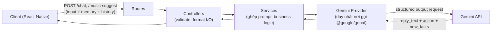

# TOMO — Backend Architecture (MVP)

> Mục đích: giúp AI/dev hiểu cấu trúc tổng thể của backend để code nhất quán. Dựa trên `ARCHITECTURE.md` (kiến trúc hệ thống tổng quan) — file này chỉ đào sâu phần backend.

---

## 1. Overview

### 1.1 Vai trò của backend
Backend là một **lớp proxy mỏng, không lưu trạng thái (stateless)**. Nó không có database, không có tài khoản người dùng, không nhớ gì giữa các request. Vai trò duy nhất:
1. Giữ Gemini API key an toàn (không bao giờ lộ ra client).
2. Nhận input đa phương thức (text/audio) + ngữ cảnh (memory, lịch sử chat) do client tự gửi lên mỗi lần.
3. Ghép thành prompt hoàn chỉnh, gọi Gemini API.
4. Chuẩn hoá kết quả trả về client dạng JSON có cấu trúc cố định (text trả lời + hành động + fact mới + sự kiện cộng điểm tiến hoá).

### 1.2 System diagram (mô tả dạng chữ)
Client (React Native app) gửi HTTPS request đến backend, kèm theo toàn bộ ngữ cảnh cần thiết trong mỗi request (vì backend không lưu session). Backend nhận request, xác thực dữ liệu đầu vào, ghép system prompt cố định (persona Tomo, guardrail an toàn) với ngữ cảnh do client gửi, rồi gọi Gemini API qua SDK chính thức. Gemini xử lý (hiểu text/audio, chọn hành động, trích fact) và trả về theo một JSON schema cố định (structured output). Backend nhận kết quả, chuẩn hoá lại thành response JSON, trả về client. Không có bước nào backend tự ghi/đọc dữ liệu lâu dài — mọi state nằm ở client.



### 1.3 Tech stack & lý do chọn

| Thành phần | Lựa chọn | Lý do |
|---|---|---|
| Runtime | **Node.js (bản LTS hiện hành)** | JavaScript thuần theo đúng ưu tiên của dự án; LTS là bản ổn định, được khuyến nghị cho production. *Lưu ý: kiểm tra bản LTS đang active tại thời điểm code (`nodejs.org`), vì Node phát hành LTS mới định kỳ.* |
| Ngôn ngữ | **JavaScript thuần** (không bắt buộc TypeScript) | Ưu tiên tốc độ setup, không cần bước build/type-check thêm — đúng tinh thần "dễ cài môi trường" của MVP. Có thể chuyển dần sang TypeScript sau nếu muốn, không ảnh hưởng kiến trúc. |
| Web framework | **Express.js** | Framework Node phổ biến nhất, khối lượng tài liệu/StackOverflow/ví dụ code khổng lồ → AI code tốt, dev dễ tìm giải pháp khi có bug. Đủ đơn giản cho 2 endpoint của MVP, không cần framework nặng hơn (NestJS...) ở giai đoạn này. |
| Gemini SDK | **`@google/genai`** (npm) | SDK Node/TypeScript chính thức, hợp nhất của Google cho Gemini API — hỗ trợ structured output, function calling, input đa phương thức (audio, text), Google Search grounding. Đây là SDK được Google khuyến nghị hiện tại (thay cho `@google/generative-ai` cũ đã ngừng phát triển thêm tính năng mới). |
| Validate request | **Zod** | Thư viện validate schema phổ biến, dùng tốt cả trong JS thuần (không bắt buộc TypeScript), cú pháp ngắn gọn, dễ AI sinh code theo. |
| Env config | **dotenv** | Chuẩn phổ biến để đọc `GEMINI_API_KEY` từ file `.env`, tránh hard-code secret trong code. |
| Package manager | **npm** | Đi kèm sẵn với Node, không cần cài thêm công cụ khác — đúng ưu tiên "dễ cài môi trường". |
| Database | **Không có** | Theo đúng quyết định kiến trúc: MVP không dùng DB, mọi state nằm ở client (xem `ARCHITECTURE.md` mục 3). |
| Testing (tuỳ chọn, không bắt buộc cho MVP) | **Jest** | Phổ biến nhất cho Node, tích hợp sẵn assertion + mocking, không cần cấu hình phức tạp. |
| Deploy (chưa cần chọn ngay) | Bất kỳ nơi chạy được Node (Render, Railway, Fly.io, Cloud Run...) | Vì backend là stateless, không phụ thuộc hạ tầng đặc biệt nào — hoãn quyết định này đến khi thực sự deploy (xem lộ trình bảo mật theo giai đoạn ở `ARCHITECTURE.md` mục 7.1). |

---

## 2. Folder structure

### 2.1 Root structure

```
tomo-backend/
├── src/
│   ├── index.js                    # entrypoint — khởi động server
│   ├── app.js                      # cấu hình Express app (middleware, mount routes)
│   ├── routes/
│   │   ├── chat.route.js           # định nghĩa POST /chat
│   │   └── music.route.js          # định nghĩa POST /music-suggest
│   ├── controllers/
│   │   ├── chat.controller.js      # nhận request, validate, gọi service, format response
│   │   └── music.controller.js
│   ├── services/
│   │   ├── chat.service.js         # business logic: ghép prompt, xử lý kết quả
│   │   └── music.service.js        # business logic riêng cho gợi ý nhạc (có grounding)
│   ├── providers/
│   │   └── gemini.provider.js      # NƠI DUY NHẤT gọi @google/genai — xem mục 3
│   ├── prompts/
│   │   ├── systemPrompt.js         # persona Tomo, guardrail an toàn tự hại, hướng dẫn gán cảm xúc theo nội dung (không theo tông giọng), tiêu chí chấm point_event (xem API_SPEC.md mục 5.4)
│   │   └── responseSchema.js       # JSON schema cho structured output (reply_text, action, new_facts, point_event...)
│   ├── schemas/
│   │   └── chatRequest.schema.js   # Zod schema validate request body từ client
│   ├── middlewares/
│   │   ├── errorHandler.js         # bắt lỗi tập trung, trả response lỗi chuẩn hoá
│   │   └── appSecret.js            # CHƯA DÙNG ở giai đoạn hiện tại — bật khi deploy public, xem ARCHITECTURE.md mục 7.1
│   └── config/
│       └── env.js                  # đọc & validate biến môi trường lúc khởi động
├── .env.example                    # mẫu biến môi trường (GEMINI_API_KEY=...)
├── package.json
└── README.md
```

### 2.2 Giải thích mỗi folder

- **`routes/`** — chỉ định nghĩa đường dẫn HTTP (`POST /chat`) và gắn với controller tương ứng. Không chứa logic gì khác.
- **`controllers/`** — lớp tiếp nhận request: validate input (dùng schema ở `schemas/`), gọi service tương ứng, format lại kết quả thành HTTP response. Không chứa business logic thật sự — chỉ "phiên dịch" giữa HTTP và service.
- **`services/`** — nơi chứa business logic: ghép `memory_md` + `recent_history` + input người dùng thành nội dung gửi Gemini, gọi `providers/gemini.provider.js`, xử lý/định dạng lại kết quả trả về (ví dụ: đảm bảo `action` luôn có giá trị hợp lệ dù Gemini không trả action nào).
- **`providers/`** — lớp duy nhất biết chi tiết kỹ thuật của Gemini API (cách gọi SDK, xử lý lỗi mạng, timeout, retry). Các lớp trên (`services/`) không cần biết Gemini SDK hoạt động thế nào, chỉ gọi hàm của provider và nhận kết quả. Nếu sau này đổi provider AI khác, chỉ cần sửa file này.
- **`prompts/`** — tách riêng nội dung "tri thức tĩnh" (system prompt, JSON schema cho structured output) ra khỏi code logic, dễ chỉnh sửa nội dung prompt mà không đụng vào service.
- **`schemas/`** — định nghĩa Zod schema để validate dữ liệu client gửi lên trước khi xử lý (tránh lỗi runtime khó debug do dữ liệu sai định dạng).
- **`middlewares/`** — các đoạn xử lý chạy trước/quanh mỗi request (bắt lỗi tập trung, sau này là kiểm tra app-secret khi cần).
- **`config/`** — đọc và validate biến môi trường một lần lúc khởi động (fail sớm nếu thiếu `GEMINI_API_KEY`, thay vì lỗi giữa chừng lúc xử lý request).

---

## 3. Layer architecture

```
Route → Controller → Service → Provider (Gemini) → Gemini API (bên ngoài)
```

**Lưu ý khác so với mô hình "Controller → Service → Repository → DB" thông thường:** vì MVP này **không có database**, layer cuối cùng không nói chuyện với DB mà nói chuyện với **Gemini API (một dịch vụ ngoài)**. Vẫn giữ nguyên tinh thần của Repository pattern: chỉ một lớp duy nhất (`providers/gemini.provider.js`) biết chi tiết kỹ thuật của nguồn dữ liệu/dịch vụ ngoài, các lớp phía trên chỉ gọi hàm trừu tượng mà không quan tâm implementation. Nhờ vậy, nếu MVP sau này thêm DB thật (ví dụ để cache), chỉ cần thêm một `repositories/` layer song song mà không phải viết lại Controller/Service.

| Layer | Trách nhiệm | Không làm gì |
|---|---|---|
| Route | Định tuyến HTTP method + path → controller | Không validate, không xử lý logic |
| Controller | Validate input (Zod), gọi service, format response, set HTTP status code | Không chứa business logic, không gọi trực tiếp Gemini SDK |
| Service | Ghép prompt từ system prompt + memory + history + input; gọi provider; xử lý/chuẩn hoá kết quả (ví dụ đảm bảo `action.type = "none"` nếu Gemini không chọn hành động nào) | Không biết chi tiết cách gọi `@google/genai` |
| Provider | Gọi `@google/genai`, cấu hình model, response schema, xử lý lỗi mạng/timeout/retry | Không chứa business logic của app (không biết Tomo là gì, chỉ biết "gọi Gemini với input X, trả về Y") |

---

## 4. Communication

### 4.1 FE ↔ BE: REST (không dùng GraphQL)

**Lý do chọn REST thay vì GraphQL:** MVP chỉ có 2 endpoint (`/chat`, `/music-suggest`), một client duy nhất (app React Native), không có nhu cầu truy vấn linh hoạt nhiều loại dữ liệu khác nhau từ nhiều client khác nhau — đây chính là tình huống GraphQL không mang lại lợi ích nhưng lại cộng thêm độ phức tạp (schema, resolver, tooling riêng). REST + JSON qua HTTPS là đủ, đơn giản hơn nhiều để dựng, test và debug — đúng tinh thần MVP.

**Endpoint chính** (chi tiết request/response đầy đủ xem `ARCHITECTURE.md` mục 4):

| Method | Path | Mô tả |
|---|---|---|
| `POST` | `/chat` | Input text hoặc audio → trả `reply_text` + `emotion_label` + `action` + `new_facts` |
| `POST` | `/music-suggest` | Gợi ý nhạc theo mood, có bật Google Search grounding để tránh bịa link YouTube |

**Format lỗi chuẩn hoá** (mọi lỗi trả về cùng shape, để client xử lý nhất quán):
```json
{
  "error": {
    "code": "INVALID_INPUT | GEMINI_ERROR | INTERNAL_ERROR",
    "message": "Mô tả ngắn gọn"
  }
}
```

### 4.2 Giữa các module nội bộ

Ở quy mô MVP (một process Node duy nhất, không có service riêng biệt), các module giao tiếp bằng **gọi hàm trực tiếp** (import/export), không cần message queue hay event bus. Luồng gọi luôn đi một chiều theo layer architecture ở mục 3 — Controller không gọi thẳng Provider, Service không tự parse HTTP request — giữ ranh giới rõ ràng để dễ test từng lớp độc lập và dễ AI sinh code đúng vị trí.

---

## 5. Ghi chú bảo mật (tham chiếu)

Backend MVP hiện tại **chưa cần triển khai biện pháp bảo mật nào** (đang ở giai đoạn dev local). Middleware `appSecret.js` đã có sẵn vị trí trong cấu trúc thư mục nhưng chưa kích hoạt — kích hoạt theo đúng lộ trình 4 giai đoạn đã mô tả chi tiết ở `ARCHITECTURE.md` mục 7.1.
