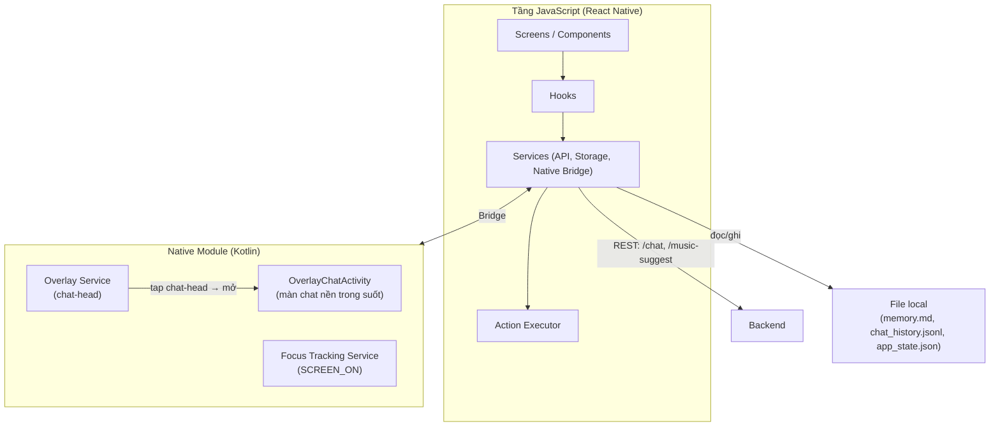

# TOMO — Frontend Architecture (MVP)

> Mục đích: giúp AI/dev hiểu cấu trúc tổng thể của app client để code nhất quán. Dựa trên `ARCHITECTURE.md` (kiến trúc hệ thống tổng quan) — file này chỉ đào sâu phần frontend (app Android).

---

## 1. Overview

### 1.1 ⚠️ Lưu ý kiến trúc quan trọng — đọc trước khi setup project

App dùng **React Native** (JavaScript) để tận dụng hệ sinh thái JS phổ biến, dễ setup môi trường, AI code tốt. Tuy nhiên, **hai tính năng lõi của Tomo không thể làm bằng JS thuần**, vì chúng là API hệ điều hành mức thấp mà React Native không expose sẵn:

1. **Overlay "chat head"** (F1) — cửa sổ nổi hiển thị đè lên app khác, dùng `WindowManager` + `TYPE_APPLICATION_OVERLAY` của Android. *Chỉ phần chat-head cần native; màn hình chat mở ra khi tap là một activity React Native nền trong suốt (xem mục 1.2), không cần nhúng RN view vào cửa sổ overlay.*
2. **Foreground service theo dõi `SCREEN_ON`** cho focus mode (F6) — service Android chạy nền, bắt broadcast hệ thống.

Hai tính năng này cần một **Native Module viết bằng Kotlin**, nhúng vào project React Native và gọi qua cầu nối (bridge) sang JS. Đây là kiến trúc lai (hybrid) tiêu chuẩn của React Native — không phải vấn đề chặn dự án, nhưng cần biết trước: project sẽ có một phần code Kotlin nhỏ, không phải 100% JavaScript. Toàn bộ phần còn lại (UI, ghi âm, phát TTS, gọi API, lưu file local, mở Intent hệ thống) làm được bằng JS thuần.

**Hệ quả cho việc chọn công cụ:** dùng **Expo với Dev Client** (không dùng app Expo Go từ CH Play để chạy thử), vì Expo Go không hỗ trợ Native Module tuỳ chỉnh. Dev Client vẫn giữ phần lớn sự tiện lợi của Expo (hot reload, thư viện `expo-*` dựng sẵn, CLI dễ dùng) trong khi cho phép nhúng code Kotlin tuỳ chỉnh.

### 1.2 System diagram (mô tả dạng chữ)

App React Native chạy trong một Activity chính, hiển thị UI (chat, settings, xem memory). Song song, một **Native Module Kotlin** quản lý overlay chat-head (hiển thị độc lập với Activity chính, kể cả khi app bị thu nhỏ) và foreground service theo dõi màn hình mở/tắt — cả hai giao tiếp ngược lại với tầng JS qua bridge (Native Module) để cập nhật UI hoặc gọi API khi cần. Khi người dùng tap vào chat-head, native module mở một **activity React Native thứ hai, nền trong suốt, style dạng nổi** (`OverlayChatActivity`) hiển thị màn hình chat đè lên app đang dùng — đây là quyết định thiết kế có chủ đích (đánh đổi: app bên dưới bị pause trong lúc mở), giúp toàn bộ UI chat viết bằng React Native thuần thay vì phải nhúng RN view vào cửa sổ overlay. Toàn bộ logic gọi backend, lưu trữ local, xử lý âm thanh nằm ở tầng JS. Khi cần trả lời người dùng, app gọi backend qua REST, nhận về JSON có `action`, rồi tầng JS (Action Executor) quyết định gọi native module (đổi animation overlay, bật/tắt focus service) hoặc gọi thư viện JS (TTS, mở Intent hệ thống).



### 1.3 Tech stack & lý do chọn

| Thành phần | Lựa chọn | Lý do |
|---|---|---|
| Framework | **React Native + Expo (Dev Client)** | JS phổ biến nhất cho mobile cross-platform, cộng đồng lớn, AI code tốt, dễ setup hơn Android native thuần. Dev Client (không phải Expo Go) để hỗ trợ Native Module tuỳ chỉnh cho overlay/focus service. |
| Ngôn ngữ | **JavaScript thuần** (không bắt buộc TypeScript) | Đúng ưu tiên đề ra, giảm bước học/setup. Có thể chuyển dần sang TypeScript từng file sau, không ảnh hưởng kiến trúc. |
| Navigation | **`@react-navigation/native`** | Thư viện điều hướng phổ biến nhất của RN, tài liệu và ví dụ code nhiều. |
| Gọi API | **`axios`** | Thông báo lỗi rõ ràng hơn `fetch` mặc định (interceptor, timeout config sẵn), phổ biến, dễ debug khi có bug mạng. |
| State toàn cục nhẹ | **Zustand** | Đơn giản hơn Redux nhiều cho quy mô MVP (điểm tiến hoá, stage, cờ overlay...), ít boilerplate, API dạng hook rất hợp với pattern Hooks đã chọn. |
| Ghi âm & phát audio | **`expo-audio`** | Thư viện chính thức hiện hành của Expo cho audio (thay thế `expo-av` đã bị deprecated) — dùng cho ghi âm push-to-talk. Cung cấp sẵn dưới dạng hook (`useAudioRecorder`), khớp tự nhiên với layer Hooks. |
| Text-to-Speech | **`expo-speech`** | Wrap trực tiếp TTS engine có sẵn của Android — đúng quyết định "dùng TTS mặc định của máy" đã chốt. |
| Lưu file local | **`expo-file-system`** | Dùng thống nhất cho cả 3 loại dữ liệu local (`memory.md`, `chat_history.jsonl`, `app_state.json`) — một API duy nhất, đỡ phải học thêm cơ chế lưu trữ khác (vd AsyncStorage) cho cùng một nhu cầu. |
| Mở Intent hệ thống (Calendar/Alarm) | Native Module nhỏ hoặc thư viện cộng đồng tương đương | Cần Intent chính xác như `AlarmClock.ACTION_SET_ALARM` / `CalendarContract.ACTION_INSERT` — kiểm tra thư viện JS hiện có khi code, nếu không đủ chi tiết thì viết native module nhỏ (đơn giản hơn overlay/focus service nhiều). |
| Native Module (Kotlin) | Overlay Service + Focus Tracking Service | Bắt buộc do giới hạn kỹ thuật đã nêu ở mục 1.1 — giao tiếp với JS qua React Native Native Module (TurboModule theo kiến trúc mới của RN). |

---

## 2. Folder structure

### 2.1 Root structure

```
tomo-app/
├── android/                          # phần native Android
│   └── app/src/main/java/.../
│       ├── OverlayService.kt         # WindowManager + TYPE_APPLICATION_OVERLAY (chat-head)
│       ├── OverlayChatActivity.kt    # activity RN nền trong suốt, mở khi tap chat-head (màn chat dạng nổi)
│       ├── FocusTrackingService.kt   # foreground service bắt SCREEN_ON
│       └── TomoNativeModule.kt       # bridge Kotlin ↔ JS
├── src/
│   ├── App.jsx                       # entrypoint, khởi tạo navigation + store; chọn stack Onboarding/Main theo cờ `onboarded` trong app_state.json
│   ├── screens/
│   │   ├── OnboardingScreen.jsx      # thiết lập lần đầu — toàn bộ luồng nhiều bước gộp trong 1 màn (F1, UC-01)
│   │   ├── ChatScreen.jsx            # màn hình chat chính (F2/F3, UC-04/05); header có icon mở EvolutionScreen
│   │   ├── EvolutionScreen.jsx       # "Hành trình của Tomo" — tiến độ điểm, stage hiện tại & kế tiếp (F8, UC-13)
│   │   ├── SettingsScreen.jsx        # cài đặt, quyền, tần suất nhắc (F1)
│   │   └── MemoryScreen.jsx          # xem/xoá memory (UC-07)
│   ├── components/
│   │   ├── TomoAvatar.jsx            # animation Tomo theo cảm xúc/trạng thái
│   │   ├── ChatBubble.jsx
│   │   └── MicButton.jsx             # nút giữ để ghi âm push-to-talk
│   ├── hooks/
│   │   ├── useChat.js                # quản lý state hội thoại, gọi chatApi
│   │   ├── useVoiceRecorder.js       # bọc expo-audio cho luồng push-to-talk
│   │   ├── useTts.js                 # bọc expo-speech
│   │   └── useMemory.js              # đọc/ghi memory.md qua memoryStorage
│   ├── services/
│   │   ├── api/
│   │   │   ├── chatApi.js            # POST /chat (axios)
│   │   │   └── musicApi.js           # POST /music-suggest
│   │   ├── storage/
│   │   │   ├── memoryStorage.js      # đọc/ghi memory.md
│   │   │   ├── historyStorage.js     # đọc/ghi chat_history.jsonl
│   │   │   └── appStateStorage.js    # đọc/ghi app_state.json
│   │   └── native/
│   │       └── overlayBridge.js      # gọi sang TomoNativeModule (start/stop overlay, focus service, mở OverlayChatActivity)
│   ├── actions/
│   │   └── actionExecutor.js         # nhận field `action` từ backend → gọi hook/service tương ứng (xem mục 3.3)
│   ├── store/
│   │   └── useAppStore.js            # Zustand: điểm tiến hoá, stage, cờ overlay bật/tắt...
│   └── constants/
│       ├── config.js                 # BASE_URL backend, timeout, tên file local, RECENT_HISTORY_LIMIT = 20
│       └── animationMapping.js       # Mapping emotion_label → animation_state → asset placeholder
├── app.config.js                     # cấu hình Expo, khai báo quyền Android (SYSTEM_ALERT_WINDOW, RECORD_AUDIO...)
├── package.json
└── README.md
```

### 2.2 Giải thích mỗi folder

- **`android/`** — phần code Kotlin thuần cho các tính năng không thể làm bằng JS (mục 1.1) cùng `OverlayChatActivity`. Đây là project native Android được Expo Dev Client sinh ra và cho phép chỉnh sửa trực tiếp. `OverlayChatActivity` là activity React Native thứ hai với nền trong suốt (theme `Theme.Translucent` hoặc tương đương), hiển thị màn hình chat dạng nổi khi người dùng tap chat-head; vì là activity thường nên dùng được toàn bộ stack JS (hooks, services, store) mà không cần nhúng RN view vào cửa sổ overlay. Đánh đổi đã chấp nhận: app bên dưới bị pause trong lúc màn chat mở.
- **`screens/`** — mỗi màn hình tương ứng một use case chính trong tài liệu yêu cầu, chỉ chứa layout + gọi hooks, không chứa logic gọi API/storage trực tiếp. `OnboardingScreen` là một màn duy nhất chứa toàn bộ luồng thiết lập nhiều bước (chào → nhập tên → xin lần lượt các quyền mic/overlay/notification), quản lý bằng state bước nội bộ; khi hoàn tất thì set cờ `onboarded` trong `app_state.json` để các lần mở app sau vào thẳng `ChatScreen`. `EvolutionScreen` được mở từ icon trên header của `ChatScreen`.
- **`components/`** — UI nhỏ, tái sử dụng, càng "dumb" (không tự gọi API) càng tốt — nhận dữ liệu qua props, dễ AI sinh code nhất quán.
- **`hooks/`** — nơi chứa logic có thể tái sử dụng và giữ state cục bộ (theo pattern Hooks của React); mỗi hook gọi xuống đúng 1-2 service tương ứng, không gọi thẳng `fetch`/`expo-file-system` trực tiếp trong component.
- **`services/api/`** — các hàm gọi REST đến backend, chỉ lo việc gửi/nhận HTTP, không chứa logic UI.
- **`services/storage/`** — đọc/ghi 3 file local đã định nghĩa ở `ARCHITECTURE.md` mục 3, dùng chung `expo-file-system`.
- **`services/native/`** — lớp duy nhất gọi sang Native Module Kotlin — các phần khác của app không cần biết chi tiết bridge hoạt động thế nào.
- **`actions/`** — hiện thực hoá cơ chế "hành động" đã thiết kế ở `ARCHITECTURE.md` mục 5: nhận `action.type` từ response backend, `switch` sang đúng hook/service (đổi animation, gọi `overlayBridge` để bật focus session, gọi Intent lịch...).
- **`store/`** — state toàn cục cần dùng ở nhiều màn hình (điểm tiến hoá, cờ bật/tắt overlay) — dùng Zustand thay vì prop-drilling qua nhiều component.
- **`constants/animationMapping.js`** — bảng mapping đã chốt ở G5: `vui` → `happy`, `buồn`/`stress` → `comfort`, `trung_lập`/null/không hợp lệ → `idle`. Các state khác do client chủ động đặt: `focused`, `speaking`, `celebrating`.

---

## 3. Layer architecture

### 3.1 Components → Hooks → Services → API (đúng đề xuất ban đầu, có bổ sung Actions)

```
Component → Hook → Service (API / Storage / Native Bridge) → nguồn dữ liệu thật
                                                                  ├── Backend (REST)
                                                                  ├── File local
                                                                  └── Native Module (Kotlin)
```

Sau khi Hook nhận kết quả có field `action` (từ `useChat` gọi `chatApi`), Hook gọi tiếp qua **`actionExecutor`** để thực thi hành động — đây là lớp bổ sung so với đề xuất ban đầu, cần thiết vì Tomo không chỉ hiển thị dữ liệu (như app thông thường) mà còn phải **thực thi hành động thật trên hệ thống** (đổi animation, bật service, mở Intent) — không phải use case tiêu chuẩn của pattern Components → Hooks → Services → API gốc, nên tách thành layer riêng cho rõ ràng.

### 3.2 Trách nhiệm từng lớp

| Layer | Trách nhiệm | Không làm gì |
|---|---|---|
| Component | Render UI, nhận input người dùng, gọi hook | Không gọi trực tiếp `axios`/`expo-file-system`/native module |
| Hook | Giữ state cục bộ, gọi service, xử lý loading/error, expose dữ liệu + hàm cho component | Không tự ý định dạng lại response HTTP (đó là việc của service/backend) |
| Service | Thực thi thao tác cụ thể (gọi API, đọc/ghi file, gọi native bridge) | Không chứa state React, không biết component nào đang gọi nó |
| Action Executor | Diễn giải `action.type` từ backend thành lệnh gọi hook/service cụ thể | Không tự quyết định hành động — chỉ thực thi theo chỉ định của backend/Gemini |

### 3.3 Luồng dữ liệu ví dụ (chat text)

1. `ChatScreen` gọi `useChat().sendMessage(text)`.
2. `useChat` gọi `chatApi.sendChat(...)` (kèm `memory_md`, `recent_history` lấy từ `useMemory`/`historyStorage`).
3. `chatApi` gửi `POST /chat`, nhận JSON kết quả.
4. `useChat` cập nhật state hội thoại (hiển thị `reply_text`), đồng thời gọi `actionExecutor.run(action)`; nếu response có `point_event = "emotional_share"` hoặc `action.type = "end_focus_session"` → cộng +1 điểm tiến hoá trong `useAppStore` và hiển thị toast "+1 kết nối 💙" (MVP chưa áp dụng chống farm — xem `API_SPEC.md` mục 5.4).
5. `actionExecutor` — tuỳ `action.type` — gọi `overlayBridge` (đổi animation), `historyStorage`/`memoryStorage` (lưu `new_facts`), hoặc mở Intent hệ thống.

---

## 4. Communication

### 4.1 FE ↔ BE: REST

App gọi backend qua REST/JSON như đã định nghĩa ở `BE_architecture.md` mục 4 — dùng `axios`, base URL cấu hình tại `constants/config.js`. Mỗi request tự mang đủ ngữ cảnh (`memory_md`, `recent_history`) vì backend không lưu session.

### 4.2 Giữa các module nội bộ (trong app)

- **Component ↛ Service trực tiếp** — luôn đi qua Hook, giữ Component "dumb" và dễ test, đồng thời tạo pattern nhất quán để AI sinh code đúng vị trí mỗi khi thêm tính năng mới.
- **JS ↔ Native Module (Kotlin)**: giao tiếp qua React Native Native Module (TurboModule theo kiến trúc mới của RN) — gọi qua `services/native/overlayBridge.js`, không gọi native module trực tiếp từ hook/component để dễ thay đổi implementation native sau này mà không ảnh hưởng tầng JS phía trên.
- Ở quy mô MVP (một app, không có nhiều module chạy song song phức tạp), không cần thêm event bus/pub-sub riêng — Zustand store đã đủ để chia sẻ state giữa các phần UI cần biết trạng thái chung (vd overlay đang bật/tắt).
